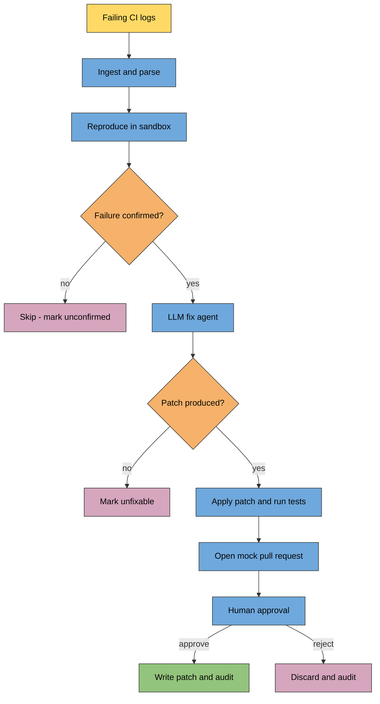

# CI Triage Agent

An agentic CI triage bot that reads failing build logs, reproduces the error locally, proposes a fix as a unified-diff patch, opens a mock pull request with test results, and routes it through an explicit human-in-the-loop approval step before anything is written to disk. Every external system (CI, Git, the PR host, the LLM) is mocked or simulated, so the whole project runs offline with no credentials — while still demonstrating the full shape of an agent embedded in an engineering workflow.

**Domain:** Agentic AI &nbsp;·&nbsp; **Language:** Python &nbsp;·&nbsp; **Demonstrates:** embedding agents into real engineering workflows, safely.

## Features

- **Mock CI simulator** that generates realistic failing build logs (syntax, import, test, and lint failures) as JSON + text artifacts.
- **Log ingestion & parsing** that classifies each failure and extracts structured metadata (file, line, message, stack trace, test name).
- **Reproduction engine** that re-runs the failure in a sandboxed subprocess and confirms it matches the original log before any fix is attempted.
- **LLM-backed fix agent** that proposes a unified-diff patch, with an automatic deterministic mock fallback when `OPENAI_API_KEY` is absent.
- **Mock Git/PR layer** that applies the patch to a throwaway repo, runs the test suite, and persists a pull-request artifact as JSON.
- **Human-in-the-loop approval** with a rich summary and `approve` / `reject` / `edit` commands, logging every decision to an audit trail.
- **End-to-end orchestrator** that wires it all together with a configurable, resilient pipeline and a non-interactive `--auto-approve` mode.

## Architecture



## Installation

```bash
git clone https://github.com/chahakgoswami/ci-triage-agent
cd ci-triage-agent
pip install -e ".[dev]"
cp .env.example .env   # optional; only needed for a real LLM
```

The project runs fully offline. Set `OPENAI_API_KEY` in `.env` only if you want real LLM-backed suggestions; otherwise the deterministic mock agent is used automatically.

## Usage

Run the whole pipeline end to end (generate sample logs, triage them, auto-approve):

```bash
ci-triage run --simulate 3 --force-mock --auto-approve
```

Or drive each stage individually:

```bash
ci-triage simulate --count 3          # generate mock failing logs in ./ci_logs
ci-triage ingest                      # parse logs into structured failures
ci-triage reproduce                   # reproduce failures in a sandbox
ci-triage suggest                     # propose fix patches
ci-triage approve pr_artifacts/pr_<id>.json   # review a single PR interactively
```

The orchestrator is also available as a module:

```bash
python -m ci_triage_agent.orchestrator --simulate 3 --force-mock --auto-approve
```

Key options: `--force-mock` always uses the stub LLM; `--auto-approve` approves every PR without prompting (for non-interactive runs); omit it to review each PR with `approve` / `reject` / `edit`.

## Project structure

```
src/ci_triage_agent/
  simulator.py      # generate mock failing CI logs
  parser.py         # ingest + classify failures -> ParsedFailure
  reproducer.py     # sandboxed reproduction -> ReproductionResult
  agent.py          # LLM (or mock) fix suggestion -> FixSuggestion
  git_pr.py         # apply patch, run tests -> MockPullRequest
  approval.py       # human-in-the-loop review + audit trail
  orchestrator.py   # end-to-end pipeline wiring (Day 7)
  cli.py            # command-line interface
tests/              # unit tests per module + integration tests for the orchestrator
```

## How it works

1. **Ingest** — `ingest_directory` reads each log and produces a `ParsedFailure` with the failure type and error location.
2. **Reproduce** — `reproduce_failure` rebuilds the error in an isolated subprocess and only proceeds if the output confirms the original failure.
3. **Suggest** — `FixSuggestionAgent.suggest_fix` returns a `FixSuggestion` containing an explanation and a unified-diff patch (mock fallback when no API key).
4. **Open PR** — `GitPRLayer.create_pull_request` applies the patch to a sandbox clone, runs the tests, and persists a `MockPullRequest` JSON artifact.
5. **Approve** — `run_approval_workflow` prints a rich summary and waits for `approve` / `reject` / `edit`, writing the final patch and an audit entry only on approval.

The `Orchestrator` runs these steps per failure, isolating errors so one bad log never aborts the batch, and classifies each outcome as approved, rejected, unconfirmed, unfixable, or error.

## Notes & roadmap

- Everything external is simulated; wiring to a real CI provider, Git host, or LLM would replace the `simulator`, `git_pr`, and `agent` layers respectively.
- Destructive actions are always gated behind explicit human confirmation — the agent proposes, a person disposes.
- Possible extensions: richer patch validation, multi-file fixes, confidence scoring, and a real pull-request integration behind the same interface.
